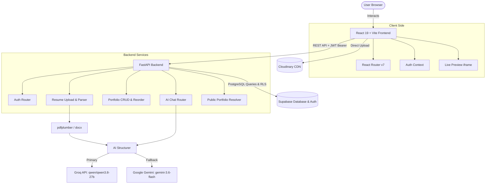

# 📄 ResumeToPortfolio

> **Transform uploaded PDF & DOCX resumes into customizable, responsive, and publishable portfolio websites in seconds with AI.**

[](https://reactjs.org/)
[](https://vitejs.dev/)
[](https://tailwindcss.com/)
[](https://fastapi.tiangolo.com/)
[](https://python.org/)
[](https://supabase.com/)
[](https://groq.com/)
[](LICENSE)

---

## 📑 Table of Contents

- [Overview](#-overview)
- [Key Features](#-key-features)
- [System Architecture](#-system-architecture)
- [Repository Structure](#-repository-structure)
- [Prerequisites](#-prerequisites)
- [Setup & Installation Guide](#-setup--installation-guide)
  - [1. Clone Repository](#1-clone-repository)
  - [2. Database & Auth Setup (Supabase)](#2-database--auth-setup-supabase)
  - [3. Backend Setup (FastAPI)](#3-backend-setup-fastapi)
  - [4. Frontend Setup (React + Vite)](#4-frontend-setup-react--vite)
  - [5. Cloudinary Setup (Image Uploads)](#5-cloudinary-setup-image-uploads)
- [Environment Variables Reference](#-environment-variables-reference)
- [API Overview](#-api-overview)
- [Deployment](#-deployment)
- [Troubleshooting & FAQs](#-troubleshooting--faqs)
- [License](#-license)

---

## 🌟 Overview

**ResumeToPortfolio** reduces the friction of building a personal online presence from scratch. Instead of spending hours designing templates and entering data, users upload their existing resume (PDF or DOCX). 

An intelligent multi-provider AI pipeline extracts structured career data (education, experience, projects, skills, achievements, and social links), loads it into a live-updating WYSIWYG editor, and lets users customize designs, reorder sections, edit text via natural-language AI chat, and publish to a shareable public URL with view tracking.

---

## ✨ Key Features

- **🤖 Multi-Provider AI Resume Extraction**: Parses PDF (`pdfplumber`) and DOCX (`python-docx`) files into strictly validated schema models. Powered primarily by **Groq** (`qwen/qwen3.8-27b`) with automatic failover to **Google Gemini** (`gemini-3.6-flash`).
- **🎨 8 Designer Portfolio Themes**:
  - `Fresh Minimal`
  - `Classic Professional`
  - `Cosmic Violet`
  - `Dark Grid`
  - `Devfolio`
  - `Emerald Editorial`
  - `Mono Illustrate`
  - `Alex Editorial`
- **⚡ Real-Time WYSIWYG Live Preview**: Isolated iframe preview with bidirectional `postMessage` synchronization for instant live updates as you type.
- **🔀 Drag-and-Drop Section Reordering**: Seamlessly reorder and organize your portfolio sections using `@dnd-kit`.
- **💬 Natural Language AI Assistant**: In-editor AI chat assistant that can modify headlines, polish work experience summaries, or rewrite sections on command.
- **🖼️ Asset Management with Cloudinary**: Quick avatar and project image uploads directly through Cloudinary.
- **🌐 Public Showcase & Slugs**: Instant public sharing (`/p/:slug`), custom subdomain routing support, and real-time view tracking.
- **🔐 Enterprise Security & Isolation**: PostgreSQL Row Level Security (RLS) on Supabase ensuring users can only read and write their own data, with public read access reserved strictly for published portfolios.

---

## 🏗️ System Architecture



---

## 📂 Repository Structure

```text
resume/
├── Ai/                           # Architecture specs & system documentation
│   ├── architecture.md           # System design & component diagrams
│   ├── backend.md                # Backend service breakdown
│   ├── codebase_memory.md        # Feature inventory & state machine
│   └── frontend.md               # Frontend UI specs and template details
│
├── backend/                      # Python FastAPI application
│   ├── app/
│   │   ├── core/                 # App configuration & Supabase auth verification
│   │   ├── routers/              # API route definitions (auth, resume, portfolios, etc.)
│   │   ├── schemas/              # Pydantic validation models
│   │   ├── services/             # Resume parsing, AI structurer, and chat services
│   │   └── main.py               # FastAPI entry point & CORS configuration
│   ├── migrations/               # Database SQL schema & RLS policies
│   │   └── 01_init.sql           # Complete Supabase database schema
│   ├── .env.example              # Backend environment template
│   ├── railway.toml              # Railway deployment configuration
│   └── requirements.txt          # Python dependencies
│
├── frontend/                     # React 19 + Vite application
│   ├── public/                   # Public static assets
│   ├── src/
│   │   ├── components/           # Layout, modals, editor panels, templates
│   │   ├── hooks/                # Custom React hooks (useAuth, etc.)
│   │   ├── lib/                  # API client, auth storage, URL helpers
│   │   ├── pages/                # Landing, Dashboard, Upload, Editor, Public view
│   │   ├── types/                # TypeScript interfaces & types
│   │   ├── App.tsx               # Route configurations
│   │   └── main.tsx              # Application entry point
│   ├── .env.example              # Frontend environment template
│   ├── package.json              # NPM dependencies & scripts
│   ├── tailwind.config.js        # Tailwind CSS styling setup
│   ├── vercel.json               # Vercel deployment configuration
│   └── vite.config.ts            # Vite build configuration
│
├── LICENSE                       # MIT License
└── README.md                     # Project documentation
```

---

## ⚙️ Prerequisites

Ensure you have the following installed on your machine:

- **Node.js**: v18.0.0 or higher (v20+ recommended)
- **npm** or **pnpm** / **yarn**
- **Python**: v3.10 or higher
- **Supabase Account**: [supabase.com](https://supabase.com) (free tier works great)
- **Groq Cloud API Key**: [console.groq.com](https://console.groq.com)
- **Google Gemini API Key**: [aistudio.google.com](https://aistudio.google.com)
- **Cloudinary Account**: [cloudinary.com](https://cloudinary.com) (for image/avatar uploads)

---

## 🚀 Setup & Installation Guide

Follow these steps to run the complete stack locally.

### 1. Clone Repository

```bash
git clone https://github.com/kaushalsahu07/resume.git
cd resume
```

---

### 2. Database & Auth Setup (Supabase)

1. Create a new project in your [Supabase Dashboard](https://supabase.com/dashboard).
2. Go to the **SQL Editor** in your Supabase project dashboard.
3. Open [`backend/migrations/01_init.sql`](backend/migrations/01_init.sql) from this repository, copy its entire contents, paste it into the Supabase SQL editor, and click **Run**.
   - This creates all necessary tables (`profiles`, `portfolios`, `education`, `experience`, `projects`, `skills`, `achievements`, `links`).
   - Enables Row Level Security (RLS) policies.
   - Configures automatic user profile creation upon signup via trigger.
4. Retrieve your Supabase keys:
   - Go to **Project Settings** > **API**.
   - Copy **Project URL** (`https://<project-ref>.supabase.co`).
   - Copy **anon / public** API Key.
   - Copy **service_role** Secret Key (keep this private!).
   - Copy **JWT Secret** (under **Project Settings** > **API** > **JWT Settings**).

---

### 3. Backend Setup (FastAPI)

1. **Navigate to the backend directory**:
   ```bash
   cd backend
   ```

2. **Create and activate a Python virtual environment**:
   - **Windows (PowerShell)**:
     ```powershell
     python -m venv venv
     .\venv\Scripts\Activate.ps1
     ```
   - **macOS / Linux**:
     ```bash
     python3 -m venv venv
     source venv/bin/activate
     ```

3. **Install dependencies**:
   ```bash
   pip install -r requirements.txt
   ```

4. **Configure environment variables**:
   Create a `.env` file by copying the example:
   ```bash
   cp .env.example .env
   ```
   Open `.env` and fill in your credentials:
   ```env
   SUPABASE_URL=https://your-project.supabase.co
   SUPABASE_ANON_KEY=your-supabase-anon-key
   SUPABASE_SERVICE_ROLE_KEY=your-supabase-service-role-key
   SUPABASE_JWT_SECRET=your-supabase-jwt-secret
   GROQ_API_KEY=gsk_your_groq_api_key
   GEMINI_API_KEY=your_gemini_api_key
   CORS_ALLOWED_ORIGIN=http://localhost:5173
   ```

5. **Start the FastAPI server**:
   ```bash
   uvicorn app.main:app --reload --host 0.0.0.0 --port 8000
   ```

6. **Verify the backend**:
   - Health Check: [http://localhost:8000/health](http://localhost:8000/health) (returns `{"status": "ok"}`)
   - Interactive Swagger API Docs: [http://localhost:8000/docs](http://localhost:8000/docs)

---

### 4. Frontend Setup (React + Vite)

1. **Open a new terminal window and navigate to the frontend directory**:
   ```bash
   cd frontend
   ```

2. **Install Node dependencies**:
   ```bash
   npm install
   ```

3. **Configure environment variables**:
   Create a `.env` file by copying the example:
   ```bash
   cp .env.example .env
   ```
   Open `.env` and configure:
   ```env
   # Backend API Base URL
   VITE_API_BASE_URL=http://localhost:8000

   # Cloudinary credentials (see step 5)
   VITE_CLOUDINARY_CLOUD_NAME=your_cloud_name
   VITE_CLOUDINARY_UPLOAD_PRESET=your_upload_preset
   ```

4. **Start the Vite development server**:
   ```bash
   npm run dev
   ```

5. **Open the web app**:
   Visit [http://localhost:5173](http://localhost:5173) in your browser.

---

### 5. Cloudinary Setup (Image Uploads)

To enable uploading profile pictures and project screenshots in the portfolio editor:

1. Log in to [Cloudinary Console](https://cloudinary.com/console).
2. Copy your **Cloud Name** from the dashboard.
3. Go to **Settings (Gear icon)** > **Upload** tab.
4. Scroll down to **Upload presets** and click **Add upload preset**.
5. Set:
   - **Upload preset name**: e.g., `resume` (or any name of your choice)
   - **Signing Mode**: **Unsigned** (required for client-side direct uploads)
6. Click **Save**.
7. Set `VITE_CLOUDINARY_CLOUD_NAME` and `VITE_CLOUDINARY_UPLOAD_PRESET` in `frontend/.env`.

---

## 🔑 Environment Variables Reference

### Backend (`backend/.env`)

| Variable | Required | Description | Example |
|---|:---:|---|---|
| `SUPABASE_URL` | Yes | Supabase Project URL | `https://xyzcompany.supabase.co` |
| `SUPABASE_ANON_KEY` | Yes | Supabase Anonymous Client Key | `eyJhbGciOi...` |
| `SUPABASE_SERVICE_ROLE_KEY` | Yes | Supabase Service Role Secret (for admin bypass and public views) | `eyJhbGciOi...` |
| `SUPABASE_JWT_SECRET` | Yes | JWT Secret used to decode and verify Supabase Auth tokens | `super-secret-jwt-token` |
| `GROQ_API_KEY` | Yes | Groq API Key for high-speed resume structuring and chat | `gsk_...` |
| `GEMINI_API_KEY` | Optional | Google Gemini API Key for automatic failover | `AIzaSy...` |
| `CORS_ALLOWED_ORIGIN` | No | Allowed frontend origin for CORS (defaults to `http://localhost:5173`) | `http://localhost:5173` |

### Frontend (`frontend/.env`)

| Variable | Required | Description | Default / Example |
|---|:---:|---|---|
| `VITE_API_BASE_URL` | Yes | Base URL pointing to the FastAPI backend | `http://localhost:8000` |
| `VITE_CLOUDINARY_CLOUD_NAME` | Optional | Cloudinary Cloud Name for direct image uploads | `my-cloud-name` |
| `VITE_CLOUDINARY_UPLOAD_PRESET` | Optional | Cloudinary unsigned preset for image uploads | `resume` |

---

## 📡 API Overview

| Method | Endpoint | Auth Required | Description |
|---|---|:---:|---|
| `GET` | `/health` | No | Health check endpoint |
| `POST` | `/auth/register` | No | Register a new user profile via Supabase Auth |
| `POST` | `/auth/login` | No | Login and retrieve session JWT token |
| `GET` | `/auth/me` | Yes | Get the authenticated user's profile |
| `POST` | `/resume/upload` | Yes | Upload PDF/DOCX file; extracts & structures into draft portfolio |
| `GET` | `/portfolios` | Yes | List all portfolios created by current user |
| `GET` | `/portfolios/{id}` | Yes | Fetch complete portfolio details by ID |
| `PUT` | `/portfolios/{id}` | Yes | Update portfolio attributes & sections |
| `DELETE` | `/portfolios/{id}` | Yes | Delete portfolio and associated child records |
| `POST` | `/portfolios/{id}/publish` | Yes | Set portfolio visibility to public |
| `POST` | `/portfolios/{id}/unpublish` | Yes | Unpublish portfolio |
| `PUT` | `/portfolios/{id}/reorder` | Yes | Update order index of portfolio sections |
| `POST` | `/portfolios/{id}/chat` | Yes | Interact with AI assistant to edit or refine portfolio data |
| `GET` | `/p/{slug}` | No | Fetch published portfolio data by slug for public view |

Explore and test all endpoints interactively at [http://localhost:8000/docs](http://localhost:8000/docs) when running locally.

---

## 🚢 Deployment

### Deploy Backend (Railway)

The backend is configured with `railway.toml` for seamless deployment to Railway:
1. Connect your GitHub repository to [Railway](https://railway.app/).
2. Set the root directory to `backend`.
3. Add the backend environment variables under the **Variables** tab in Railway.
4. Railway automatically detects Python via Nixpacks and starts the app with:
   ```bash
   uvicorn app.main:app --host 0.0.0.0 --port $PORT
   ```

### Deploy Frontend (Vercel / Netlify)

1. Connect your repository to [Vercel](https://vercel.com/) or [Netlify](https://netlify.com/).
2. Set the **Root Directory** to `frontend`.
3. Configure build settings:
   - **Build Command**: `npm run build`
   - **Output Directory**: `dist`
4. Add environment variables:
   - `VITE_API_BASE_URL`: Your deployed backend URL (e.g. `https://your-backend.up.railway.app`)
   - `VITE_CLOUDINARY_CLOUD_NAME` & `VITE_CLOUDINARY_UPLOAD_PRESET`
5. SPA route rewrites are pre-configured in `frontend/vercel.json`.

---

## ❓ Troubleshooting & FAQs

<details>
<summary><b>1. "413 Request Entity Too Large" during AI Parsing</b></summary>

Groq's free tier imposes strict TPM (Tokens Per Minute) limitations. The backend limits `max_tokens=2048` and uses `qwen/qwen3.8-27b`. If you encounter rate limits, make sure you configure `GEMINI_API_KEY` in `backend/.env` — the app automatically switches to Gemini as a seamless fallback.
</details>

<details>
<summary><b>2. Supabase RLS Permission Denied or Empty Public View</b></summary>

If public portfolio URLs (`/p/:slug`) return 404 or empty content:
- Verify that you ran the full migration script in [`backend/migrations/01_init.sql`](backend/migrations/01_init.sql).
- Ensure `SUPABASE_SERVICE_ROLE_KEY` is provided in `backend/.env`. Public resolution uses the service role client on the server to query published portfolios safely.
- Ensure the portfolio has `is_published = true`.
</details>

<details>
<summary><b>3. CORS Errors in Browser Console</b></summary>

Ensure your frontend URL (e.g., `http://localhost:5173`) is allowed in `CORS_ALLOWED_ORIGIN` in `backend/.env`. The backend allows `localhost:5173`, `localhost:3000`, as well as standard Vercel app domains by default.
</details>

<details>
<summary><b>4. Cloudinary "Upload preset not found" or "Signature Error"</b></summary>

Ensure your Cloudinary preset mode is set to **Unsigned**. Signed uploads require backend authorization, whereas unsigned presets allow direct client-side uploads.
</details>

---

## 📄 License

This project is licensed under the [MIT License](LICENSE).